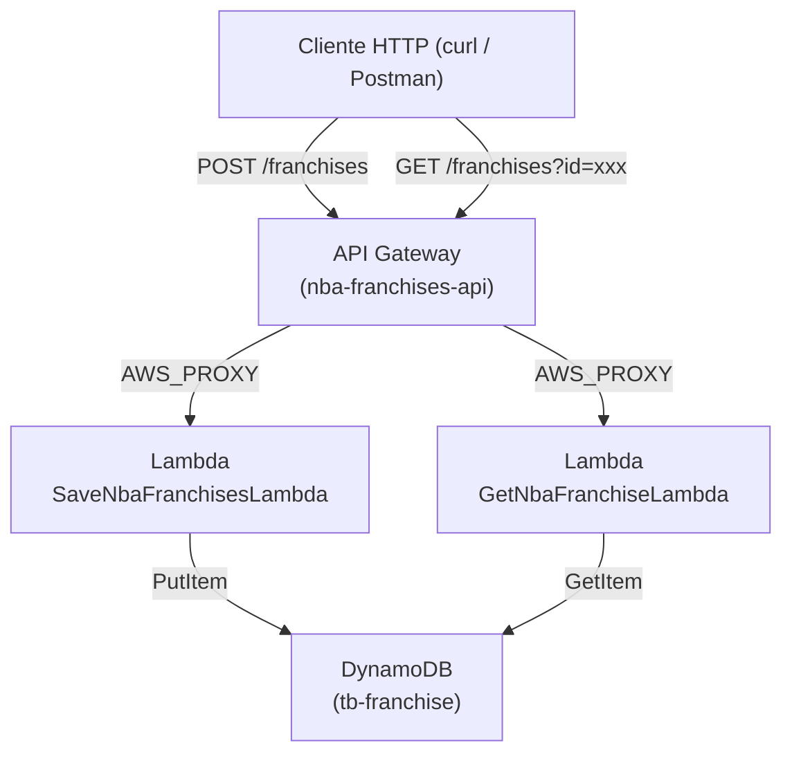
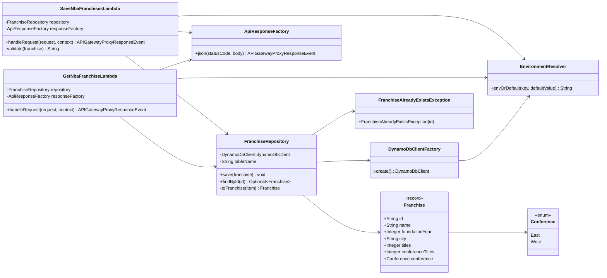
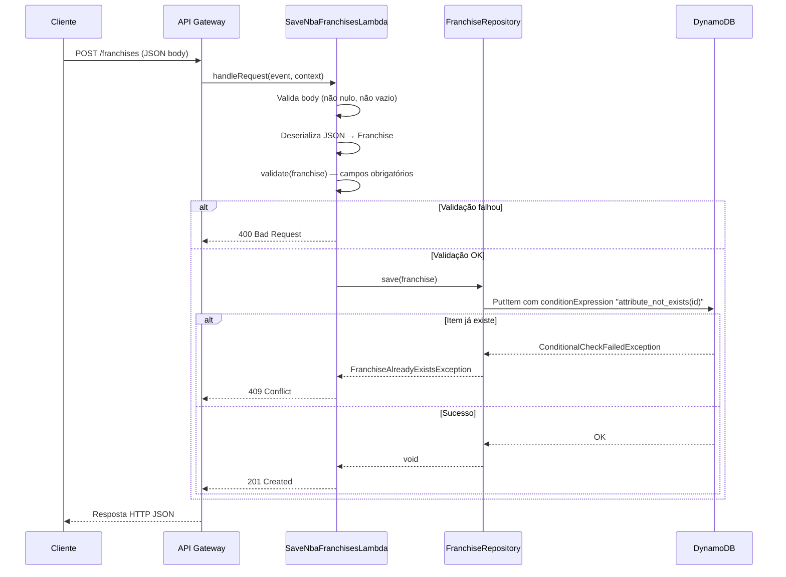
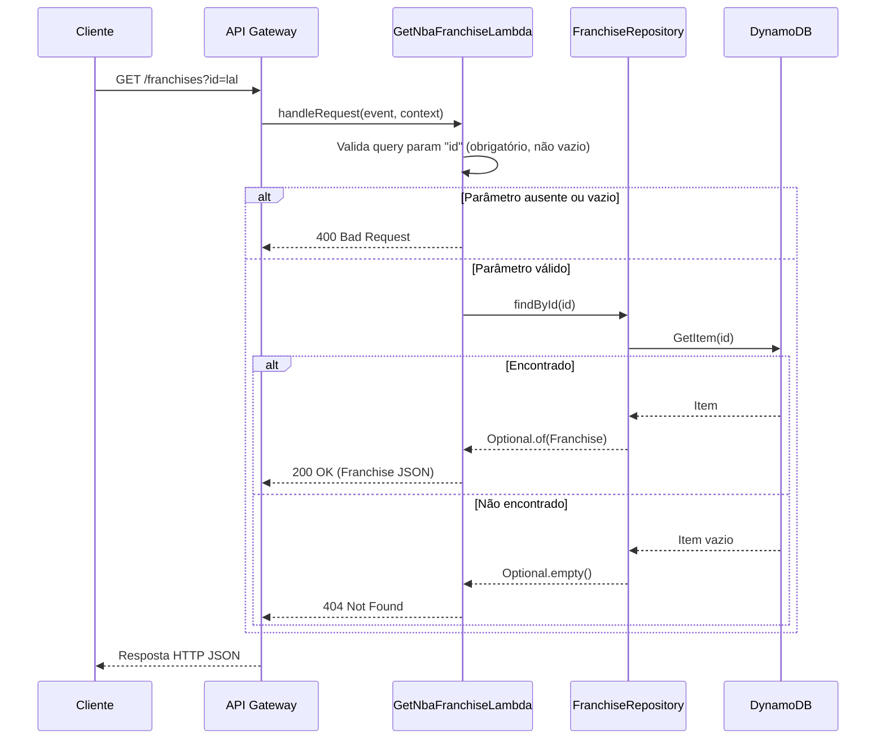
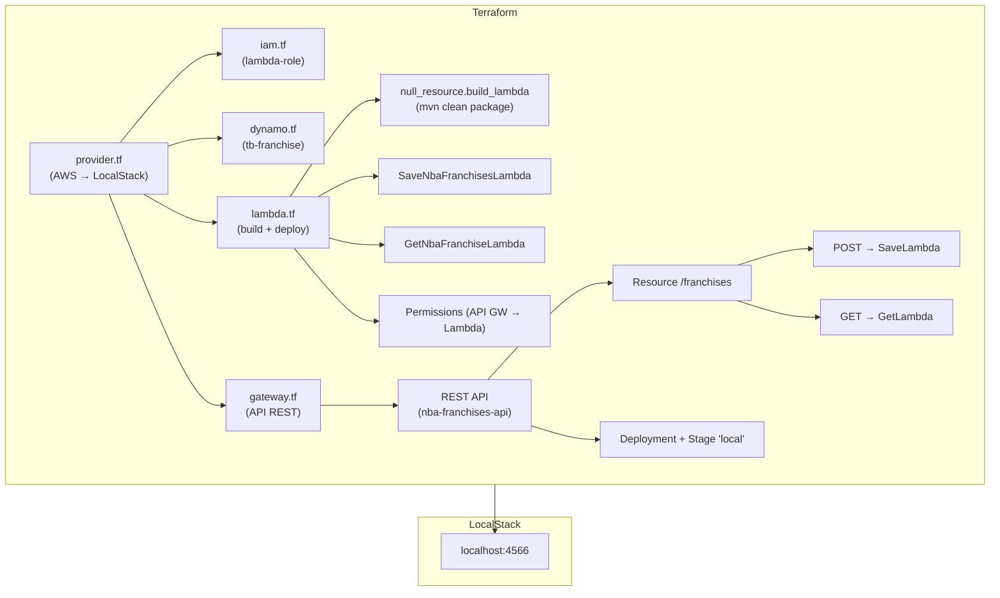

# NBA Franchises Lambda

API serverless para gerenciamento de franquias da NBA, implementada com **AWS Lambda** (Java 21), **API Gateway** e **DynamoDB**. Toda a infraestrutura é provisionada localmente via **LocalStack** e gerenciada com **Terraform**.

---

## Visão Geral

O projeto expõe dois endpoints REST — um para cadastro e outro para consulta de franquias da NBA — seguindo a arquitetura:

```text
Cliente HTTP → API Gateway → AWS Lambda → DynamoDB
```

Cada operação é implementada em uma função Lambda independente, empacotada em um único JAR (uber-jar) e implantada no LocalStack para desenvolvimento e testes locais.

---

## Arquitetura

### Diagrama Geral



### Diagrama de Componentes



---

## Estrutura do Projeto

```text
lambda-java-tests/
├── compose.yml                          # Docker Compose — LocalStack
├── .env                                 # Variáveis de ambiente locais
├── pom.xml                              # Build Maven
├── src/
│   ├── main/java/com/gasfgrv/franchises/
│   │   ├── exception/
│   │   │   └── FranchiseAlreadyExistsException.java
│   │   ├── handler/
│   │   │   ├── SaveNbaFranchisesLambda.java   # Handler POST /franchises
│   │   │   └── GetNbaFranchiseLambda.java     # Handler GET  /franchises
│   │   ├── model/
│   │   │   ├── Franchise.java           # Record do modelo de dados
│   │   │   └── Conference.java          # Enum (East, West)
│   │   ├── repository/
│   │   │   └── FranchiseRepository.java # Acesso ao DynamoDB
│   │   ├── response/
│   │   │   └── ApiResponseFactory.java  # Fábrica de respostas HTTP/JSON
│   │   └── util/
│   │       ├── DynamoDbClientFactory.java  # Criação do DynamoDbClient
│   │       └── EnvironmentResolver.java   # Leitura de variáveis de ambiente com fallback
│   └── test/java/com/gasfgrv/franchises/
│       ├── handler/
│       │   ├── GetNbaFranchiseLambdaTest.java
│       │   └── SaveNbaFranchisesLambdaTest.java
│       ├── repository/
│       │   └── FranchiseRepositoryTest.java
│       ├── response/
│       │   └── ApiResponseFactoryTest.java
│       └── util/
│           └── DynamoDbClientFactoryTest.java
├── terraform/
│   ├── provider.tf         # Provider AWS apontando para LocalStack
│   ├── dynamo.tf           # Tabela DynamoDB
│   ├── lambda.tf           # Funções Lambda + permissões
│   ├── gateway.tf          # API Gateway (REST API, rotas, deploy, stage)
│   └── iam.tf              # IAM Role para as Lambdas
└── .localstack/            # Volume persistido do LocalStack
```

---

## Tecnologias Utilizadas

| Categoria          | Tecnologia / Biblioteca                        | Versão  |
|--------------------|------------------------------------------------|---------|
| Linguagem          | Java                                           | 21      |
| Build              | Apache Maven                                   | —       |
| Runtime            | AWS Lambda (runtime `java21`)                  | —       |
| AWS SDK            | `software.amazon.awssdk:dynamodb`              | 2.28.29 |
| AWS SDK HTTP       | `software.amazon.awssdk:url-connection-client` | 2.28.29 |
| Lambda Core        | `com.amazonaws:aws-lambda-java-core`           | 1.2.3   |
| Lambda Events      | `com.amazonaws:aws-lambda-java-events`         | 3.13.0  |
| Serialização       | Jackson Databind                               | 2.17.2  |
| Testes             | JUnit Jupiter                                  | 5.10.2  |
| Mocking            | Mockito                                        | 5.11.0  |
| Assertions         | AssertJ                                        | 3.26.0  |
| Testes (env vars)  | JUnit Pioneer                                  | 2.2.0   |
| Infra local        | LocalStack (Docker)                            | latest  |
| IaC                | Terraform (provider `hashicorp/aws`)           | 6.28.0  |
| Empacotamento      | Maven Shade Plugin                             | 3.6.0   |
| Testes (runner)    | Maven Surefire Plugin                          | 3.5.3   |

---

## Fluxo da Aplicação

### Fluxo de Cadastro (POST)



### Fluxo de Consulta (GET)



---

## Configuração

### Pré-requisitos

| Ferramenta            | Descrição                                                              |
|-----------------------|------------------------------------------------------------------------|
| Java 21 (JDK)         | Compilação e empacotamento do projeto                                  |
| Apache Maven          | Gerenciamento de dependências e build                                  |
| Docker                | Necessário para executar o LocalStack                                  |
| Docker Compose        | Orquestração do container LocalStack                                   |
| Terraform             | Provisionamento da infraestrutura no LocalStack                        |
| LocalStack Auth Token | Token de autenticação do LocalStack (variável `LOCALSTACK_AUTH_TOKEN`) |

---

## Variáveis de Ambiente

### Variáveis do arquivo `.env` (Docker Compose / scripts locais)

| Variável                | Descrição                                       | Valor exemplo                                         |
|-------------------------|-------------------------------------------------|-------------------------------------------------------|
| `AWS_REGION`            | Região AWS                                      | `us-east-1`                                           |
| `AWS_ENDPOINT_URL`      | Endpoint do LocalStack                          | `http://localhost:4566`                               |
| `TABLE_NAME`            | Nome da tabela DynamoDB                         | `tb-franchise`                                        |
| `SAVE_FUNCTION_NAME`    | Nome da função Lambda de cadastro               | `SaveNbaFranchisesLambda`                             |
| `GET_FUNCTION_NAME`     | Nome da função Lambda de consulta               | `GetNbaFranchiseLambda`                               |
| `LAMBDA_ROLE_ARN`       | ARN da role IAM para as Lambdas                 | `arn:aws:iam::000000000000:role/lambda-role`          |
| `JAR_FILE`              | Caminho do artefato JAR                         | `target/nba-franchises-lambda.jar`                    |

### Variáveis de ambiente das Lambdas (definidas no Terraform)

| Variável            | Descrição                                               | Valor                                     |
|---------------------|---------------------------------------------------------|-------------------------------------------|
| `TABLE_NAME`        | Nome da tabela DynamoDB utilizada pelo repositório      | `tb-franchise`                            |
| `AWS_ENDPOINT_URL`  | Endpoint do DynamoDB (LocalStack, via host interno)     | `http://host.docker.internal:4566`        |
| `AWS_REGION`        | Região AWS                                              | `us-east-1`                               |

> **Nota:** As Lambdas executam dentro de containers Docker gerenciados pelo LocalStack. Por isso, o endpoint usa `host.docker.internal` em vez de `localhost`.

### Variáveis utilizadas pela aplicação (via `EnvironmentResolver`)

| Variável            | Utilizada por                        | Comportamento quando ausente                    |
|---------------------|--------------------------------------|-------------------------------------------------|
| `TABLE_NAME`        | Handlers (Save/Get)                  | Usa `tb-franchise` como padrão                  |
| `AWS_REGION`        | `DynamoDbClientFactory`              | Usa `us-east-1` como padrão                     |
| `AWS_ENDPOINT_URL`  | `DynamoDbClientFactory`              | Não configura endpoint override (usa AWS real)  |
| `AWS_ACCESS_KEY`    | `DynamoDbClientFactory`              | Usa `test` como padrão                          |
| `AWS_SECRET_KEY`    | `DynamoDbClientFactory`              | Usa `test` como padrão                          |

---

## Execução Local

### 1. Subir o LocalStack

```bash
docker compose up -d
```

O container `localstack-lambda` será iniciado na porta `4566` com os serviços: `lambda`, `dynamodb`, `apigateway`, `iam`, `logs` e `sts`.

### 2. Compilar o projeto

```bash
mvn clean package
```

O artefato gerado será: `target/nba-franchises-lambda.jar`

### 3. Provisionar a infraestrutura

```bash
cd terraform
terraform init
terraform apply -auto-approve
```

Isso criará automaticamente:

- Tabela DynamoDB `tb-franchise`
- Role IAM `lambda-role`
- Lambda `SaveNbaFranchisesLambda`
- Lambda `GetNbaFranchiseLambda`
- API Gateway `nba-franchises-api` com rotas `POST /franchises` e `GET /franchises`
- Stage `local` com deployment

> O Terraform também executará `mvn clean package` automaticamente (via `null_resource.build_lambda`) quando detectar alterações nos arquivos `.java` ou no `pom.xml`.

### 4. Obter a URL da API

Após o `terraform apply`, a URL da API será exibida no output `api_url`:

```text
http://localhost:4566/restapis/{api_id}/local/_user_request_/franchises
```

---

## Testes

### Stack de testes

Os testes são **unitários** e utilizam:

- **JUnit Jupiter 5** como framework de testes
- **Mockito** para mocking de dependências (`DynamoDbClient`, `FranchiseRepository`, `Context`)
- **AssertJ** para assertions fluentes
- **JUnit Pioneer** para manipulação de variáveis de ambiente via `@SetEnvironmentVariable`

### Classes de teste

| Classe de Teste               | Classe Testada           | Cenários                                                                                            |
|-------------------------------|--------------------------|-----------------------------------------------------------------------------------------------------|
| `SaveNbaFranchisesLambdaTest` | `SaveNbaFranchisesLambda`| Salvar com sucesso; body nulo; body vazio; payload inválido; franquia duplicada                     |
| `GetNbaFranchiseLambdaTest`   | `GetNbaFranchiseLambda`  | Buscar com sucesso; query params ausentes; id ausente; id em branco; não encontrada                 |
| `FranchiseRepositoryTest`     | `FranchiseRepository`    | Salvar com sucesso; salvar duplicada (ConditionalCheckFailed); buscar existente; buscar inexistente |
| `ApiResponseFactoryTest`      | `ApiResponseFactory`     | JSON com sucesso; preservar status code; resposta de erro; falha na serialização                    |
| `DynamoDbClientFactoryTest`   | `DynamoDbClientFactory`  | Com AWS_REGION; sem AWS_REGION; com AWS_ENDPOINT_URL; sem AWS_ENDPOINT_URL                          |

### Executar os testes

```bash
mvn test
```

> O Surefire está configurado com `--add-opens=java.base/java.lang=ALL-UNNAMED` para permitir o funcionamento do JUnit Pioneer (manipulação de variáveis de ambiente via reflexão no Java 21).

---

## Build

O build é gerenciado pelo Maven e utiliza o **Maven Shade Plugin** para gerar um uber-jar (fat JAR) contendo todas as dependências.

```bash
mvn clean package
```

| Artefato                              | Descrição                                       |
|---------------------------------------|-------------------------------------------------|
| `target/nba-franchises-lambda.jar`    | Uber-jar pronto para deploy na AWS Lambda       |

### Configuração relevante do Shade Plugin

- `createDependencyReducedPom` = `false` — não gera POM reduzido
- `finalName` = `nba-franchises-lambda` — nome fixo do artefato

---

## Infraestrutura

Toda a infraestrutura é definida no diretório `terraform/` e provisionada contra o **LocalStack** (endpoint `http://localhost:4566`).

### Fluxo de Provisionamento



### Recursos provisionados

| Recurso Terraform                          | Tipo                              | Nome / Identificador              |
|--------------------------------------------|-----------------------------------|-----------------------------------|
| `aws_iam_role.lambda_role`                 | IAM Role                          | `lambda-role`                     |
| `aws_dynamodb_table.franchise_tb`          | DynamoDB Table                    | `tb-franchise`                    |
| `null_resource.build_lambda`               | Build trigger                     | `mvn clean package`               |
| `aws_lambda_function.save_nba_franchises`  | Lambda Function                   | `SaveNbaFranchisesLambda`         |
| `aws_lambda_function.get_nba_franchises`   | Lambda Function                   | `GetNbaFranchiseLambda`           |
| `aws_lambda_permission` (×2)               | Lambda Permission                 | Permissão API Gateway → Lambda    |
| `aws_api_gateway_rest_api`                 | API Gateway REST API              | `nba-franchises-api`              |
| `aws_api_gateway_resource`                 | API Gateway Resource              | `/franchises`                     |
| `aws_api_gateway_method` (×2)              | API Gateway Method                | `POST`, `GET`                     |
| `aws_api_gateway_integration` (×2)         | API Gateway Integration           | `AWS_PROXY`                       |
| `aws_api_gateway_deployment`               | API Gateway Deployment            | —                                 |
| `aws_api_gateway_stage`                    | API Gateway Stage                 | `local`                           |

### Provider

O provider AWS está configurado com credenciais fictícias (`test`/`test`) e todos os endpoints apontando para `http://localhost:4566` (LocalStack). As validações de credenciais e metadata API são desabilitadas.

---

## Deploy

O deploy é **local** e automatizado pelo Terraform.

### Passo a passo completo

```bash
# 1. Subir o LocalStack
docker compose up -d

# 2. Compilar o projeto (opcional — o Terraform faz isso automaticamente)
mvn clean package

# 3. Provisionar infraestrutura e fazer deploy
cd terraform
terraform init
terraform apply -auto-approve

# 4. Verificar a URL da API (output do Terraform)
terraform output api_url
```

### Re-deploy após alterações no código

O `null_resource.build_lambda` monitora alterações nos arquivos `.java` e no `pom.xml` via hash. Para forçar um re-deploy:

```bash
cd terraform
terraform apply -auto-approve
```

### Destruir a infraestrutura

```bash
cd terraform
terraform destroy -auto-approve
```

---

## Endpoints / API

Base URL: `http://localhost:4566/restapis/{api_id}/local/_user_request_`

> O `{api_id}` é gerado dinamicamente pelo LocalStack e exibido no output `api_id` do Terraform.

### POST /franchises

Cadastra uma nova franquia da NBA.

**Request:**

```bash
curl -X POST \
  "http://localhost:4566/restapis/{api_id}/local/_user_request_/franchises" \
  -H "Content-Type: application/json" \
  -d '{
    "id": "lal",
    "name": "Los Angeles Lakers",
    "foundationYear": 1947,
    "city": "Los Angeles",
    "titles": 17,
    "conferenceTitles": 32,
    "conference": "West"
  }'
```

**Respostas:**

| Status | Descrição                        | Exemplo de body                                              |
|--------|----------------------------------|--------------------------------------------------------------|
| `201`  | Franquia cadastrada com sucesso  | `{"message":"Franchise saved successfully","id":"lal"}`      |
| `400`  | Body ausente ou campo inválido   | `{"message":"id is required"}`                               |
| `409`  | Franquia já existe               | `{"message":"Franchise already exists: lal"}`                |
| `500`  | Erro interno                     | `{"message":"Internal server error"}`                        |

### GET /franchises?id={id}

Consulta uma franquia por ID.

**Request:**

```bash
curl "http://localhost:4566/restapis/{api_id}/local/_user_request_/franchises?id=lal"
```

**Respostas:**

| Status | Descrição                      | Exemplo de body                                                                                                                             |
|--------|--------------------------------|---------------------------------------------------------------------------------------------------------------------------------------------|
| `200`  | Franquia encontrada            | `{"id":"lal","name":"Los Angeles Lakers","foundationYear":1947,"city":"Los Angeles","titles":17,"conferenceTitles":32,"conference":"West"}` |
| `400`  | Parâmetro `id` ausente/vazio   | `{"message":"Query parameter id is required"}`                                                                                              |
| `404`  | Franquia não encontrada        | `{"message":"Franchise not found: lal"}`                                                                                                    |
| `500`  | Erro interno                   | `{"message":"Internal server error"}`                                                                                                       |

---

## Persistência e Modelo de Dados

### Tabela DynamoDB

| Propriedade    | Valor            |
|----------------|------------------|
| Nome           | `tb-franchise`   |
| Billing Mode   | `PAY_PER_REQUEST`|
| Partition Key  | `id` (String)    |

### Atributos armazenados

| Atributo          | Tipo DynamoDB | Tipo Java           | Descrição                          |
|-------------------|---------------|---------------------|------------------------------------|
| `id`              | `S` (String)  | `String`            | Identificador único da franquia    |
| `name`            | `S` (String)  | `String`            | Nome da franquia                   |
| `foundationYear`  | `N` (Number)  | `Integer`           | Ano de fundação                    |
| `city`            | `S` (String)  | `String`            | Cidade sede                        |
| `titles`          | `N` (Number)  | `Integer`           | Número de títulos (campeonatos)    |
| `conferenceTitles`| `N` (Number)  | `Integer`           | Número de títulos de conferência   |
| `conference`      | `S` (String)  | `Conference` (enum) | Conferência (`East` ou `West`)     |

### Regra de unicidade

O método `save` utiliza `conditionExpression("attribute_not_exists(id)")` para garantir idempotência. Se um item com o mesmo `id` já existir, uma `ConditionalCheckFailedException` é capturada e convertida em `FranchiseAlreadyExistsException`.

---

## Decisões Técnicas Relevantes

### 1. Uber-JAR com Maven Shade Plugin

O projeto empacota todas as dependências em um único JAR (`nba-franchises-lambda.jar`) via Maven Shade Plugin. Essa é a abordagem padrão para Lambdas Java, pois o runtime da AWS Lambda não suporta resolução de dependências em tempo de execução.

### 2. Duas Lambdas, um único artefato

Ambas as funções (`SaveNbaFranchisesLambda` e `GetNbaFranchiseLambda`) são empacotadas no mesmo JAR, mas configuradas com `handler` distintos no Terraform. Isso simplifica o build e o deploy ao custo de incluir código não utilizado em cada função.

### 3. Injeção de dependências manual (construtor duplo)

Cada handler possui dois construtores:

- **Construtor público sem argumentos** — usado pela AWS Lambda em runtime; instancia as dependências reais (`DynamoDbClientFactory.create()`, `new FranchiseRepository(...)`, `new ApiResponseFactory()`).
- **Construtor package-private com parâmetros** — usado nos testes unitários para injetar mocks.

Essa abordagem evita frameworks de DI (Spring, Guice) mantendo o cold start rápido.

### 4. `UrlConnectionHttpClient` em vez do Apache HTTP Client

O `DynamoDbClientFactory` usa `UrlConnectionHttpClient`, que é mais leve e reduz o tamanho do JAR e o cold start em comparação ao Apache HTTP Client (padrão do AWS SDK v2).

### 5. Credenciais fictícias com fallback

O `DynamoDbClientFactory` utiliza `StaticCredentialsProvider` com credenciais `test`/`test` como padrão, compatíveis com o LocalStack. Isso indica que o projeto foi projetado primariamente para execução local.

### 6. Centralização de variáveis de ambiente com `EnvironmentResolver`

A classe utilitária `EnvironmentResolver` centraliza a leitura de variáveis de ambiente com fallback para valores padrão via o método `envOrDefault(key, defaultValue)`. É utilizada pelos handlers (para `TABLE_NAME`) e pelo `DynamoDbClientFactory` (para `AWS_REGION`, `AWS_ACCESS_KEY`, `AWS_SECRET_KEY`). Isso permite que a configuração seja alterada via variáveis de ambiente sem necessidade de recompilação.

### 7. Build automático via Terraform

O `null_resource.build_lambda` executa `mvn clean package` automaticamente durante o `terraform apply`, usando hashes dos arquivos fonte e do `pom.xml` como triggers de rebuild.

### 8. `@SetEnvironmentVariable` do JUnit Pioneer

Os testes de `DynamoDbClientFactory` usam a anotação `@SetEnvironmentVariable` do JUnit Pioneer para manipular variáveis de ambiente em tempo de teste. Isso requer `--add-opens=java.base/java.lang=ALL-UNNAMED` configurado no Maven Surefire Plugin.

---

## Possíveis Limitações e Pontos de Atenção

| # | Ponto                                                                                                                                                                                                                                                                                                                                    |
|---|------------------------------------------------------------------------------------------------------------------------------------------------------------------------------------------------------------------------------------------------------------------------------------------------------------------------------------------|
| 1 | **Credenciais estáticas para LocalStack:** O `DynamoDbClientFactory` usa credenciais fixas (`test`/`test`) como padrão via `EnvironmentResolver`. Para deploy em ambiente AWS real, seria necessário alterar a estratégia de credenciais (ex: `DefaultCredentialsProvider`) ou definir as variáveis `AWS_ACCESS_KEY` e `AWS_SECRET_KEY`. |
| 2 | **Sem CI/CD configurado:** Não foram identificados pipelines de integração contínua (GitHub Actions, Jenkins, etc.) no repositório.                                                                                                                                                                                                      |
| 3 | **Sem tratamento de erros do `GetNbaFranchiseLambda` para `id` em branco com espaços:** O handler verifica `isBlank()`, mas o query param `" "` (espaço) não é tratado da mesma forma por todos os clientes HTTP.                                                                                                                        |
| 4 | **`source_code_hash` com paths inconsistentes:** Em `lambda.tf`, a Lambda `save_nba_franchises` usa `${dirname(path.module)}/../target/...` enquanto `get_nba_franchises` usa `${dirname(path.root)}/../target/...`. Dependendo da estrutura de execução, isso pode gerar comportamentos diferentes.                                     |
| 5 | **Sem paginação ou listagem:** Não há endpoint para listar todas as franquias cadastradas; apenas consulta por ID é suportada.                                                                                                                                                                                                           |
| 6 | **Sem autenticação:** Os endpoints do API Gateway estão configurados com `authorization = "NONE"`.                                                                                                                                                                                                                                       |
